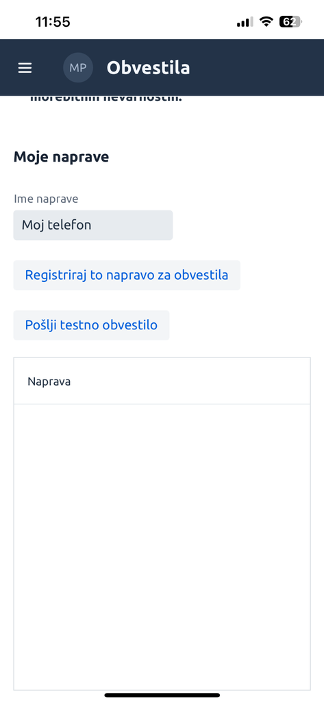

Tukaj je izboljšana različica besedila:

---

# Apple Push obvestila

Sledite spodnjim korakom za namestitev in aktivacijo obvestil na napravi Apple.

## 1. Kliknite na spodnjo sredinsko ikono za deljenje

## 2. Izberite možnost `Dodaj na domači zaslon` (`Add to Home Screen`)

## 3. Potrdite z `Dodaj` (`Add`)

## 4. Na domačem zaslonu se bo pojavila nova ikona aplikacije **Vodostaj**

## 5. V meniju obvestil registrirajte svojo napravo

## 6. Dovolite prejemanje obvestil (`Allow`)

## 7. Pošljite testno obvestilo

## 8. Prejeto testno obvestilo se prikaže na vrhu zaslona

---

## Hvala Matjažu P. za pripravo navodil za Apple Push obvestila.