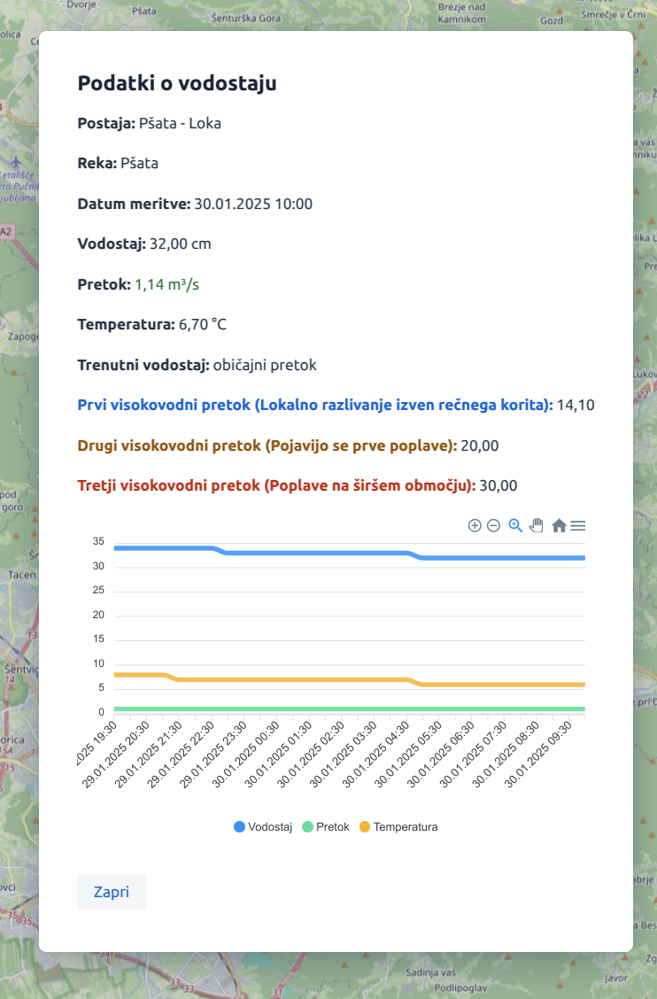

# 🌊 Pomen podatkov o vodostajih in pretokih

Dobrodošli v sistemu za spremljanje vodostajev in hidroloških podatkov!  
V tem dokumentu boste našli razlago ključnih podatkov, ki so prikazani v moji aplikaciji.

Za več info pišite na mail [Uroš Kristan](mailto:uros.kristan@gmail.com)

---
❗ **Podatki so pridobljeni iz spletnega vira agencije ARSO!**

---

- pri pretoku je z barvo označeno za kateri razred pretoka gre
- zeleno - mali pretok, oz. pod visokovodnim pretokom

## 📌 **Osnovni podatki postaje**
Hidrološke postaje merijo različne parametre o vodah. Vsaka postaja ima naslednje osnovne podatke:

| **Podatek** | **Opis**                                                    |
|------------|-------------------------------------------------------------|
| **Ime reke** | Ime reke ali vodotoka, kjer se nahaja postaja.              |
| **Merilno mesto** | Natančnejša lokacija postaje (npr. "Topole" na reki Pšati). |
| **Šifra postaje** | Edinstvena koda postaje, ki jo določi Agencija za okolje.   |
| **Geografska širina (latitude)** | Zemljepisna širina lokacije postaje.                        |
| **Geografska dolžina (longitude)** | Zemljepisna dolžina lokacije postaje.                       |
| **Kota 0 vodomera** | Višina merilne točke nad morjem (m).                        |

---

## 📏 **Podatki o vodostaju**
Vodostaj pove, kako visoka je voda na merilni postaji.

| **Podatek** | **Opis** |
|------------|---------|
| **Trenutni vodostaj (cm)** | Višina vode na postaji v **centimetrih**. |
| **Značilni vodostaj** | Razvrstitev glede na višino: |
| **➡ Mali vodostaj** | Nizek nivo vode, običajno v sušnih obdobjih. |
| **➡ Običajni vodostaj** | Povprečna vrednost vodostaja za ta del leta. |
| **➡ Veliki vodostaj** | Višji nivo, ki pa še ne povzroča poplav. |
| **➡ Prvi visokovodni vodostaj** | Začne se lokalno razlivanje izven struge. |
| **➡ Drugi visokovodni vodostaj** | Pojavijo se prve poplave. |
| **➡ Tretji visokovodni vodostaj** | Obsežne poplave na širšem območju. |

---

## 💦 **Podatki o pretoku reke**
Pretok meri, koliko vode v določenem trenutku teče skozi merilno mesto.

| **Podatek** | **Opis** |
|------------|---------|
| **Trenutni pretok (m³/s)** | Količina vode, ki na sekundo preteče skozi postajo (**kubični metri na sekundo**). |
| **Značilni pretok** | Razvrstitev glede na hitrost pretoka: |
| **➡ Mali pretok** | Majhna količina vode (sušni pogoji). |
| **➡ Običajni pretok** | Povprečna količina vode za ta čas v letu. |
| **➡ Veliki pretok** | Visoka količina vode, a brez večjih posledic. |
| **➡ Prvi visokovodni pretok** | Lokalno razlivanje izven rečnega korita. |
| **➡ Drugi visokovodni pretok** | Pojavijo se prve poplave. |
| **➡ Tretji visokovodni pretok** | Poplave na širšem območju. |

---

## 🌡️ **Dodatni podatki**
Poleg osnovnih meritev aplikacija prikazuje še naslednje parametre:

| **Podatek** | **Opis** |
|------------|---------|
| **Temperatura vode (°C)** | Trenutna temperatura vode v stopinjah Celzija. |
| **Povprečna višina valov (m)** | Povprečna višina zgornje tretjine valov, če so prisotni. |
| **Smer valovanja (°)** | Kot iz katerega prihajajo valovi (odklon od severa). |

---

## 🏡 **Kako razumeti podatke o poplavah?**
Vsaka hidrološka postaja ima določene **značilne visokovodne vrednosti**:

1️⃣ **Prvi visokovodni nivo** → Začne se lokalno razlivanje reke izven struge.  
2️⃣ **Drugi visokovodni nivo** → Pojavijo se poplave na širšem območju.  
3️⃣ **Tretji visokovodni nivo** → Velike poplave na širšem območju.

🔴 **Pomembno:** Presežene vrednosti ne pomenijo avtomatsko razglasitve nevarnosti! Oceno stopnje nevarnosti objavlja **ARSO** na spletni strani.

📌 **Več informacij:**  
🔗 [ARSO - Napoved vodostajev](https://www.arso.gov.si/vode/napovedi/)  
🔗 [ARSO - Opozorila](https://www.arso.gov.si/vode/opozorila/)

---

## ⚠ **Omejitve podatkov**
- Nekatere postaje ne merijo **pretoka**, ampak le **vodostaj**.
- Če podatkov ni na voljo, so lahko prikazani kot **prazna polja**.
- Čas v aplikaciji je prikazan v **lokalnem času (CET / CEST)**.

---

# Vsi podatki so pridobljeni iz spletnega vira agencije ARSO!

❗ **Podatki so zgolj informativni!**
