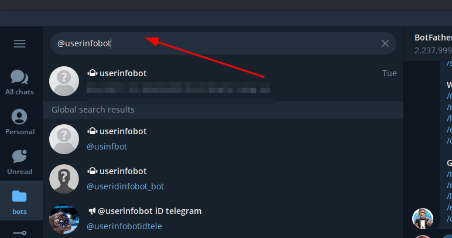
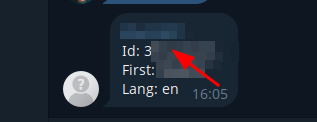
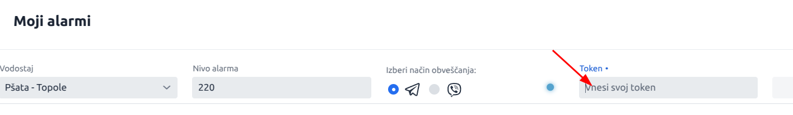

# Kako Nastaviti Alarme v Telegramu

Sledite tem preprostim korakom, da boste prejemali opozorila o vodostaju v Telegramu! 🌊📲

---

## **️1. Povezava do telegram robota**
[https://t.me/urosk_vodostaj_bot](https://t.me/urosk_vodostaj_bot)

**👉  Kliknite na link, da odprete bota.**

## **2. Kliknite gumb "START"**
📩 Ko odprete bota, **kliknite gumb "START"**.  
✅ To omogoči botu, da vam pošilja obvestila.

---

## **3.  Pridobite svoj ID za Telegram obvestila**
📌 Vaš bot potrebuje vaš **Telegram ID**, da vam lahko pošilja alarme.

🛠 **Kako ga dobite?**

1. V Telegramu poiščite in odprite bota **@userinfobot**.
2. Kliknite **START** in bot vam bo pokazal vaš **CHAT ID**.
3. Kopirajte številko, ki jo vidite.

🖼 **Primer**  
📜 **ID**: `123456789`  

---

## **4. Nastavite vaš ID v aplikaciji**
💡 **Odprite aplikacijo in v nastavitvah vnesite** svoj **ID**, ki ste ga kopirali.

🖼 **Primer vnosa ID**  
📩 **Vnesite svoj ID tukaj:**  

✅ **Shrani spremembe** in bot vam bo začel pošiljati opozorila!

---

## **5. Preizkusite delovanje**
🚀 Ko ste vnesli svoj **CHAT ID**, preverite, ali bot deluje:

👉 Kliknite **"Pošlji testno sporočilo"**  
📲 Če ste vse nastavili pravilno, boste v Telegramu prejeli sporočilo **"Vaš alarmni bot deluje!"** 🎉

---

## **🔔 Kaj lahko zdaj storite?**
✅ **Nastavite alarme za vodostaj** in **prejmite opozorila v Telegramu**.  
✅ **Prejemajte takojšnje obvestilo**, ko se nivo vode dvigne.  
✅ **Prilagodite nastavitve**, da dobite opozorila samo za določene postaje.

--

## **📢 Pogosta vprašanja**
**❓ Ne prejemam sporočil! Kaj storiti?**  
👉 Prepričajte se, da ste **kliknili START** pri botu.  
👉 Preverite, ali ste **pravilen CHAT ID** kopirali v aplikacijo.  
👉 Pošljite testno sporočilo in preverite, ali bot deluje.

**❓ Kako spremenim svojo opozorilno postajo?**  
👉 Odprite aplikacijo in izberite drugo postajo.

---

## **🎉 Zdaj ste pripravljeni na prejemanje alarmov v Telegramu!**

---
